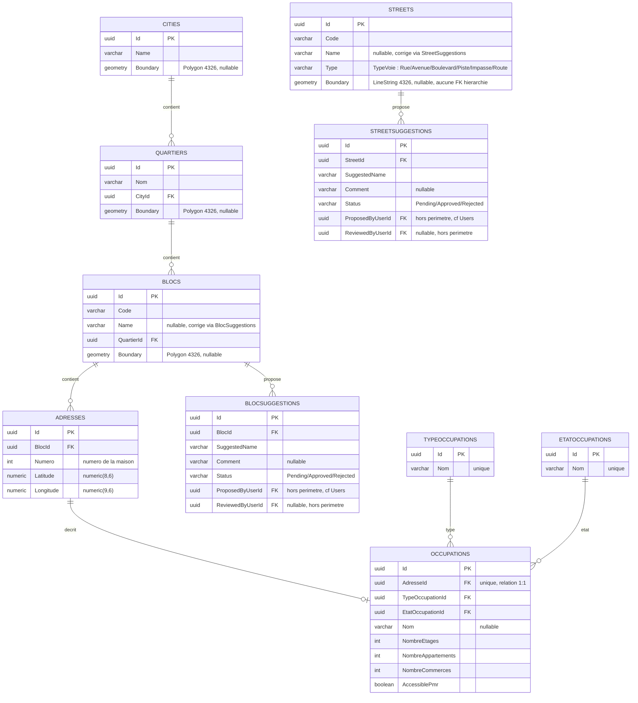

# Schéma de données — Recensement / Adressage (DAS)

Document de référence pour revue technique GIS. Périmètre : hiérarchie géographique et adressage uniquement — les tables du module authentification/RBAC (`Users`, `Roles`, `Permissions`, `UserRoles`, `RolePermissions`, `RefreshTokens`) sont hors périmètre et non détaillées ici.

Base : PostgreSQL 17 + extension **PostGIS 3.5**. SRID `4326` (WGS84) sur toutes les colonnes géométriques.

## Hiérarchie

```
City (ville)
 └─ Quartier
     └─ Bloc
         └─ Adresse
             └─ Occupation (0 ou 1)

Street (rue) — entité autonome, hors hiérarchie ci-dessus
```

Une adresse s'exprime avec exactement quatre éléments — **numéro de la maison, numéro ou nom du bloc, quartier, ville** — décision du responsable projet du 2026-08-08 qui a supprimé les niveaux `Commune`, `Arrondissement` et `Lot` du schéma (voir `docs/plans/recensement-geographie.md`).

Chaque niveau (`City`, `Quartier`, `Bloc`) porte son propre polygone de délimitation (`Boundary`), indépendant des niveaux parents/enfants. `Adresse` est un point (numéro de maison + coordonnées) rattaché directement à un `Bloc` ; sa réponse API expose aussi un libellé complet calculé (`"{Numero} {Bloc}, {Quartier}, {City}"`) ainsi que ses composants bruts. `Occupation` décrit ce qui occupe une `Adresse` (bâtiment, terrain nu...) en relation 1:1. `Street` (rue) n'a **aucune** FK vers cette hiérarchie : une rue réelle traverse fréquemment plusieurs quartiers, donc lui imposer un `QuartierId` unique (sur le modèle de `Bloc`) aurait forcé un choix arbitraire — elle existe donc seule, avec pour seule délimitation un tracé (`LineString`), pas un polygone comme les 3 niveaux administratifs. `Bloc` et `Street` portent chacun un `Code` obligatoire (identifiant technique posé à la création) et un `Name` nullable (désignation réelle de terrain, souvent inconnue à la saisie) : ce `Name` se complète via un workflow de suggestion (`BlocSuggestions`/`StreetSuggestions`) — un agent terrain propose une valeur, un Superviseur/Gestionnaire l'approuve ou la rejette, sans jamais modifier directement `Bloc`/`Street`.

## Diagramme



## Détail des tables

### `Cities`

Ville — sommet de la hiérarchie d'adressage.

| Colonne | Type | Nullable | Description |
|---|---|---|---|
| `Id` | `uuid` | non (PK) | |
| `Name` | `character varying(200)` | non | |
| `Boundary` | `geometry(Polygon, 4326)` | oui | Contour de la ville |

### `Quartiers`

| Colonne | Type | Nullable | Description |
|---|---|---|---|
| `Id` | `uuid` | non (PK) | |
| `Nom` | `character varying(200)` | non | |
| `CityId` | `uuid` | non | FK → `Cities.Id`, `ON DELETE CASCADE` |
| `Boundary` | `geometry(Polygon, 4326)` | oui | Contour du quartier |

Index : `(CityId)`.

### `Blocs`

| Colonne | Type | Nullable | Description |
|---|---|---|---|
| `Id` | `uuid` | non (PK) | |
| `Code` | `character varying(200)` | non | Code/identifiant technique du bloc, posé à la création |
| `Name` | `character varying(200)` | oui | Désignation réelle du bloc sur le terrain, souvent inconnue à la saisie — complétée via le workflow `BlocSuggestions` (voir notes) |
| `QuartierId` | `uuid` | non | FK → `Quartiers.Id`, `ON DELETE CASCADE` |
| `Boundary` | `geometry(Polygon, 4326)` | oui | Contour du bloc (îlot) |

Index : `(QuartierId)`.

### `BlocSuggestions`

Proposition de nom pour un `Bloc` par un agent terrain, à valider par un Superviseur/Gestionnaire — voir `docs/plans/recensement-geographie.md` pour le détail du workflow RBAC. Table de workflow, pas un niveau géographique : pas de colonne `Boundary`.

| Colonne | Type | Nullable | Description |
|---|---|---|---|
| `Id` | `uuid` | non (PK) | |
| `BlocId` | `uuid` | non | FK → `Blocs.Id`, `ON DELETE CASCADE` |
| `SuggestedName` | `character varying(200)` | non | Nom proposé, appliqué à `Blocs.Name` si approuvé |
| `Comment` | `character varying(1000)` | oui | Contexte libre de l'agent (ex. « écrit à la peinture sur le mur nord ») |
| `Status` | `character varying(20)` | non | `Pending`/`Approved`/`Rejected` — enum C# stocké en string, `Pending` par défaut |
| `ProposedByUserId` | `uuid` | non | FK → `Users.Id` (hors périmètre de ce document), `ON DELETE RESTRICT` |
| `ProposedAtUtc` | `timestamp with time zone` | non | |
| `ReviewedByUserId` | `uuid` | oui | FK → `Users.Id`, `ON DELETE RESTRICT`, renseigné une fois traitée |
| `ReviewedAtUtc` | `timestamp with time zone` | oui | |
| `RejectionReason` | `character varying(1000)` | oui | Renseigné seulement si `Status = Rejected` |

Index : `(BlocId)` **unique partiel** (`WHERE Status = 'Pending'`) — une seule suggestion en attente à la fois par bloc.

### `Streets`

Rue — entité **autonome**, sans FK vers la hiérarchie `City`/`Quartier`/`Bloc` : une rue réelle traverse souvent plusieurs quartiers, donc pas de `QuartierId` unique imposé. Seul niveau du schéma dont le contour est un tracé (`LineString`) plutôt qu'un polygone.

| Colonne | Type | Nullable | Description |
|---|---|---|---|
| `Id` | `uuid` | non (PK) | |
| `Code` | `character varying(200)` | non | Code/identifiant technique de la rue, posé à la création |
| `Name` | `character varying(200)` | oui | Désignation réelle de la rue sur le terrain, souvent inconnue à la saisie — complétée via le workflow `StreetSuggestions` (même principe que `BlocSuggestions`) |
| `Type` | `character varying(20)` | non | `Rue`/`Avenue`/`Boulevard`/`Piste`/`Impasse`/`Route` — enum C# stocké en string |
| `Boundary` | `geometry(LineString, 4326)` | oui | Tracé de la rue |

### `StreetSuggestions`

Même principe que `BlocSuggestions`, appliqué à `Streets` : proposition de nom par un agent terrain, validée par un Superviseur/Gestionnaire.

| Colonne | Type | Nullable | Description |
|---|---|---|---|
| `Id` | `uuid` | non (PK) | |
| `StreetId` | `uuid` | non | FK → `Streets.Id`, `ON DELETE CASCADE` |
| `SuggestedName` | `character varying(200)` | non | Nom proposé, appliqué à `Streets.Name` si approuvé |
| `Comment` | `character varying(1000)` | oui | Contexte libre de l'agent |
| `Status` | `character varying(20)` | non | `Pending`/`Approved`/`Rejected`, `Pending` par défaut |
| `ProposedByUserId` | `uuid` | non | FK → `Users.Id` (hors périmètre de ce document), `ON DELETE RESTRICT` |
| `ProposedAtUtc` | `timestamp with time zone` | non | |
| `ReviewedByUserId` | `uuid` | oui | FK → `Users.Id`, `ON DELETE RESTRICT`, renseigné une fois traitée |
| `ReviewedAtUtc` | `timestamp with time zone` | oui | |
| `RejectionReason` | `character varying(1000)` | oui | Renseigné seulement si `Status = Rejected` |

Index : `(StreetId)` **unique partiel** (`WHERE Status = 'Pending'`) — une seule suggestion en attente à la fois par rue.

### `Adresses`

Point d'adressage — pas un type géométrique, coordonnées stockées en `numeric` simple.

| Colonne | Type | Nullable | Description |
|---|---|---|---|
| `Id` | `uuid` | non (PK) | |
| `BlocId` | `uuid` | non | FK → `Blocs.Id`, `ON DELETE CASCADE` |
| `Numero` | `integer` | non | Numéro de la maison, unique dans son bloc |
| `Latitude` | `numeric(8,6)` | non | ~11 cm de précision |
| `Longitude` | `numeric(9,6)` | non | ~11 cm de précision |

Index : `(BlocId, Numero)` **unique**.

### `Occupations`

Ce qui occupe une adresse (bâtiment, terrain nu, etc.). Relation **1:1** avec `Adresses` — une adresse a au plus une occupation ; l'adresse peut exister sans occupation renseignée.

| Colonne | Type | Nullable | Description |
|---|---|---|---|
| `Id` | `uuid` | non (PK) | |
| `AdresseId` | `uuid` | non | FK → `Adresses.Id`, `ON DELETE CASCADE`, **unique** (1:1) |
| `TypeOccupationId` | `uuid` | non | FK → `TypeOccupations.Id`, `ON DELETE RESTRICT` |
| `EtatOccupationId` | `uuid` | non | FK → `EtatOccupations.Id`, `ON DELETE RESTRICT` |
| `Nom` | `character varying(200)` | oui | Nom du bâtiment/institution, si pertinent |
| `NombreEtages` | `integer` | non | |
| `NombreAppartements` | `integer` | non | |
| `NombreCommerces` | `integer` | non | |
| `AccessiblePmr` | `boolean` | non | Accessibilité personnes à mobilité réduite |

### `TypeOccupations` (table de référence, seedée au démarrage)

| Colonne | Type | Nullable |
|---|---|---|
| `Id` | `uuid` | non (PK) |
| `Nom` | `character varying(100)` | non, unique |

Valeurs actuelles : Maison individuelle, Villa, Immeuble d'habitation, Immeuble mixte (logements + commerces), Commerce, Administration, École, Mosquée, Hôpital, Terrain nu, Entrepôt.

### `EtatOccupations` (table de référence, seedée au démarrage)

| Colonne | Type | Nullable |
|---|---|---|
| `Id` | `uuid` | non (PK) |
| `Nom` | `character varying(100)` | non, unique |

Valeurs actuelles : Bon état, Dégradé, En construction, En ruine.

## Notes pour la revue GIS

- **SRID 4326 (WGS84)** partout où il y a de la géométrie — pas de projection locale/métrique appliquée à ce stade.
- **`Boundary` est nullable à chaque niveau** (`City`, `Quartier`, `Bloc`, `Street`) : une entité peut exister avant que son contour/tracé ne soit tracé/importé. Aucune contrainte de validité géométrique (`ST_IsValid`) ni de contrainte topologique (non-chevauchement entre polygones frères, inclusion stricte parent/enfant — `Bloc` ⊂ `Quartier` ⊂ `City`) n'est actuellement appliquée en base — à discuter si c'est un besoin.
- **`Street.Boundary` est le seul `LineString` du schéma**, tous les autres niveaux géométriques sont des `Polygon` — reflète qu'une rue est un tracé, pas une surface fermée. `Street` n'a par ailleurs aucune FK vers la hiérarchie géographique (voir plus haut), donc aucune contrainte, topologique ou non, ne la relie à un `Quartier`.
- **`Adresse` est un point simple (`numeric` lat/long), pas un type `geometry(Point, 4326)`** : choix fait faute de besoin de requête spatiale identifié sur ce niveau à ce jour (contrairement aux polygones de délimitation, qui ont justifié le passage à PostGIS). Peut être reconsidéré.
- **Cascade descendante** : supprimer une `City` supprime en cascade `Quartiers` → `Blocs` → `Adresses` → `Occupations`, et emporte aussi les `BlocSuggestions` de chaque `Bloc` supprimé. `Streets` est hors de cette chaîne (aucune FK vers la hiérarchie) : supprimer une `City`/`Quartier`/`Bloc` ne touche jamais `Streets` ; supprimer une `Street` emporte en revanche ses `StreetSuggestions`. Seules les FK vers les tables de référence (`TypeOccupations`, `EtatOccupations`) sont en `RESTRICT`. `BlocSuggestions.ProposedByUserId`/`ReviewedByUserId` et `StreetSuggestions.ProposedByUserId`/`ReviewedByUserId` sont en `RESTRICT` vers `Users` (hors périmètre) : un utilisateur ayant proposé ou validé une suggestion ne peut pas être supprimé tant qu'elle existe.
- **`BlocSuggestions`/`StreetSuggestions` : au plus une ligne `Pending` par `Bloc`/`Street`**, via un index unique partiel (`WHERE Status = 'Pending'`) plutôt qu'une contrainte d'unicité classique — les lignes `Approved`/`Rejected` s'accumulent sans limite (historique conservé), seule la concurrence de suggestions actives est empêchée.
- **Libellé d'adresse calculé, non stocké** : l'API expose un champ `Libelle` sur `Adresse` (`"{Numero} {Bloc}, {Quartier}, {City}"`), construit à la lecture par jointure `Adresses → Blocs → Quartiers → Cities` — aucune colonne dédiée en base, pas de risque de désynchronisation si un nom parent change.
- **Plus de niveau parcellaire** : `Lot` (parcelle cadastrale, qui devait porter le foncier) a été supprimé le 2026-08-08 avec `Commune` et `Arrondissement`. La gestion de la propriété/du titre foncier, si elle revient au programme, devra être reposée sur une autre base — aucune géométrie de parcelle n'est plus stockée.
- Pas encore de recensement du détail ménage/individu à l'intérieur d'une `Occupation` — hors périmètre actuel du projet.
